  

  

  

    My work lives at the intersection of robust infrastructure and elegant software. I architect environments where complexity is managed gracefully, ensuring that security is a foundational property rather than an afterthought.
  

  

  <a href="https://go.boutouil.me/portfolio" target="_blank">Portfolio</a> &nbsp;&middot;&nbsp; 
  <a href="https://blog.boutouil.me" target="_blank">Security Research blog</a> &nbsp;&middot;&nbsp; 
  <a href="https://status.boutouil.me" target="_blank">Network Status</a> &nbsp;&middot;&nbsp; 
  <a href="https://go.boutouil.me/email" target="_blank">Contact me</a>

  

  COPYRIGHT © 2026 - AMINE BOUTOUIL

